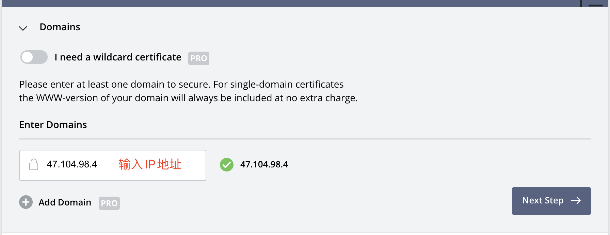
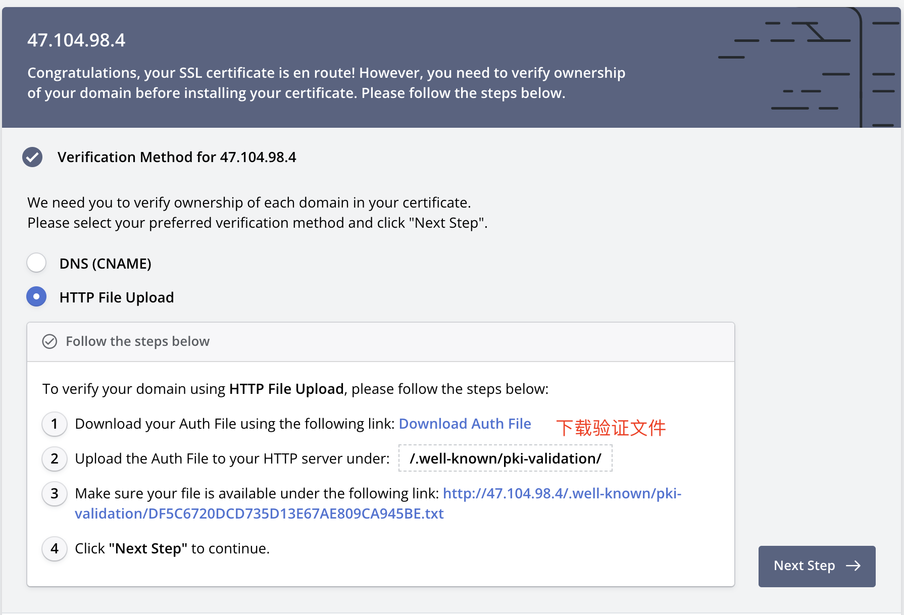

# 资源托管

可以将主题托管到自己的云资源或CDN加速节点节点上。

例如我的网站为 `www.dbnuo.com`（IP或其它host），我将编译后的文件夹 `dist` 放到了网站的根目录。

这样我可以通过加载 `https://www.dbnuo.com/dist/simpleMemory.js` 来加载主题：

```html
<script type="text/javascript">
    window.cnblogsConfig = {
      info: {
        name: 'userName', // 用户名
        startDate: '2021-01-01', // 入园时间，年-月-日。入园时间查看方法：鼠标停留园龄时间上，会显示入园时间
        avatar: 'http://xxxx.png', // 用户头像
      },
    }
</script>
<script src="https://www.dbnuo.com/dist/simpleMemory.js" defer></script>
```

## 云服务器托管-Docker容器化

> 注意`Cnblogs`是https站点，所以引入第三方资源的站点也必须是`https`，详见[https混合内容](https://developer.mozilla.org/zh-TW/docs/Web/Security/Mixed_content)

##### 1. 申请SSL证书（已有证书跳过此步骤）

- 以[ZeroSSL](https://app.zerossl.com/dashboard)申请证书为例， 面板中点击`New Certificate`，输入IP地址-选择90天免费证书


- 验证域名所有权，下载验证文件，替换仓库路径`./well-known/pki-validation`下的.txt文件

  
- 服务器中拉取仓库代码, 执行`docker-compose up -d` - [ZeroSSL](https://app.zerossl.com/dashboard)点击校验

##### 2. 安装证书
- ZeroSSl下载的证书包，需要将模块包`ca-boundle.crt`和并到`certificate.crt`中（手动扣过去就行）,并替换仓库`ssl`下的证书文件
- 服务器拉取最新代码，执行`docker compose up -d --force-recreate  --build --remove-orphans`